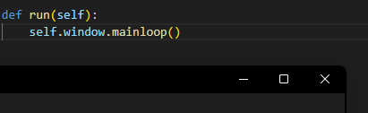

# Ollama Chat Application

This is a simple chat application built using `PyQt6` that integrates with the `Ollama` model server. You can interact with the app either by downloading the precompiled executable or by running it directly from the source. Code base also offers a UI tool to utilize OCR for text extraction by draging a selection box and having OCR analyze the screenshot. The OCR extraction is not implemented within the chat app yet, its a standalone tool.

## Installation

### From Source

1. **Download the Zip**: 
   - Download the zip from the repository.
   - Unzip the files.
   - Navigate to the `/dist` directory.
   - Run the precompiled `main.exe` directly.

2. **From Clone**:
   - Clone the repository from GitHub:
     ```bash
     git clone https://github.com/TLAMHutto/ollamaChat.git
     ```
   - Navigate to the project directory:
     ```bash
     cd ollamaChat
     ```
   - Install using:
     ```bash
     pipx install PyChat
     ```

3. **To use the OCR tool**:
  - First install Google's Tesseract OCR model [text](https://github.com/tesseract-ocr/tesseract)
  - Set up your systems enviromental variables as necessary
  - By default the software is install into your C:\Program Files\Tesseract-OCR\tesseract.exe if you're running Windows, however if you need to change the directory make sure you update your ocr_window.py to reflect the change. ```class OCR:
    def __init__(self, app):
        self.app = app
        pytesseract.pytesseract.tesseract_cmd = r'C:\Program Files\Tesseract-OCR\tesseract.exe'```
  - Install dependencies as needed
  - While in root directory run ```py ocr_window.py``` to start
