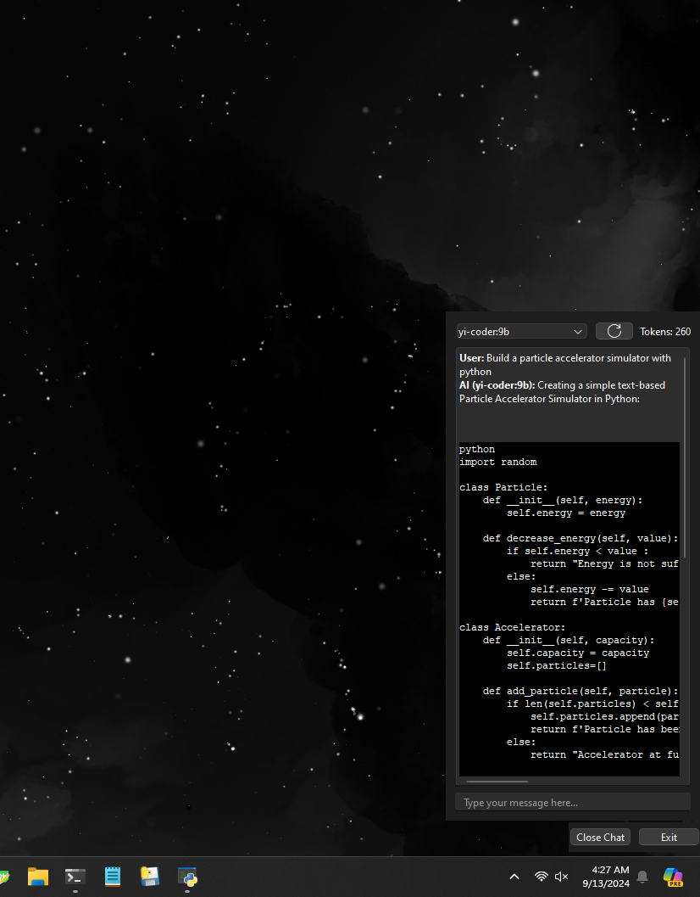

# Ollama Chat Application

This is a simple chat application built using `PyQt6` that integrates with the `Ollama` model server. You can interact with the app either by downloading the precompiled executable or by running it directly from the source. App also offers a UI tool to utilize OCR for text extraction by draging a selection box and having OCR analyze the screenshot.

## Installation

### From Source

1. **Download the Zip or clone**: 
   - Navigate to root directory and run ```py main.py```

2. **Or download the main.exe release**

3. **To use the OCR tool**:
  - First install Google's Tesseract OCR model [here](https://github.com/tesseract-ocr/tesseract)
  - Set up your systems enviromental variables as necessary
  - By default the software is install into your C:\Program Files\Tesseract-OCR\tesseract.exe if you're running Windows

  - When using the OCR every screenshot you process output is automatically injected into chat, examples of usage would be take a screenshot of code, preform OCR, and in chat ask something like "What is this code doing" and hit enter. If you dont want the OCR output text injected into chat make sure to hit 'Clear' in the OCR window.
