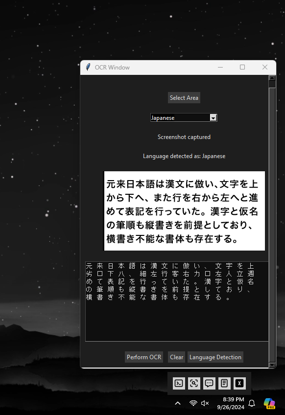
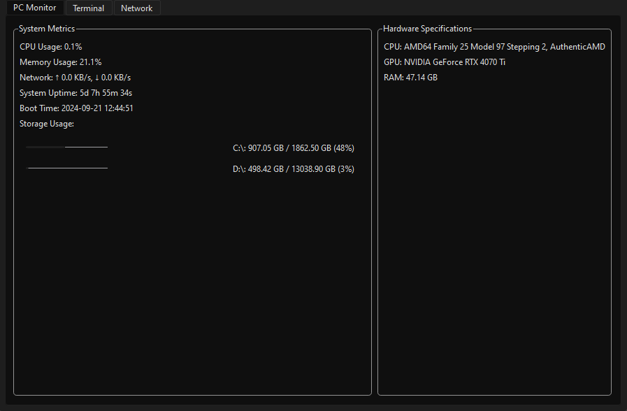
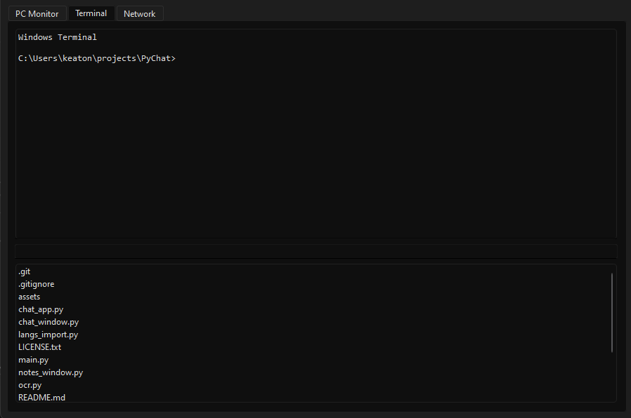
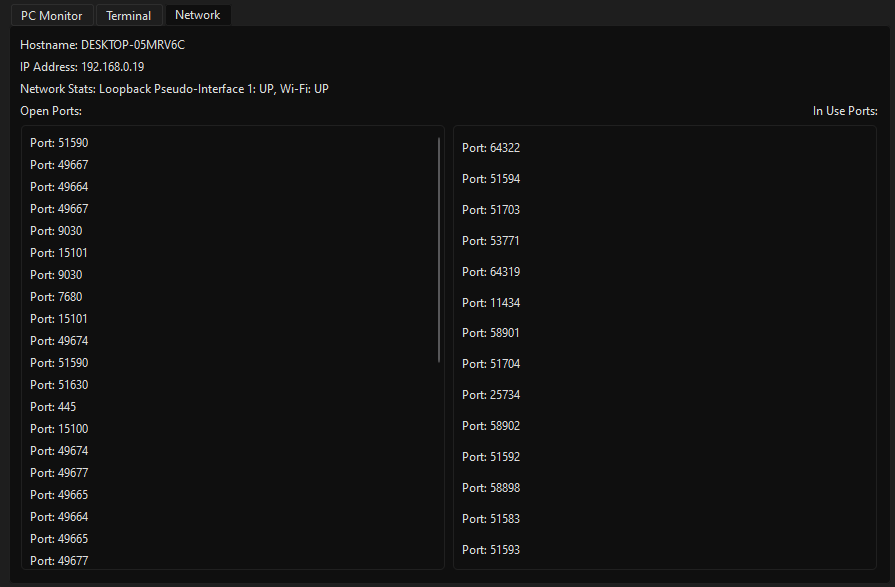

# Ollama Chat Application  This is a simple chat application built using **PyQt6** and **Tkinter** that integrates with the **Ollama** model server. It also offers a UI tool to utilize **OCR** for text extraction by dragging a selection box and having OCR analyze the screenshot. Additionally, it features note-saving functionality. You can use the app either by cloning, downloading the zip, or by downloading the `.exe`

## Installation  1. **Download the Zip or Clone**:     - Navigate to the root directory and run     ``py main.py``.  Install dependencies as needed.

2.  **To Use the OCR Tool**:
    
    -   First, install Google's Tesseract OCR model [here](https://github.com/tesseract-ocr/tesseract).
        
    -   This app uses **pytesseract**; more info can be found [here](https://github.com/h/pytesseract).
        
    -   Set up your system's environmental variables as necessary.
        
    -   By default, the software is installed in `C:\Program Files\Tesseract-OCR\tesseract.exe` if you're running Windows.
    -   Install the languages you want supported for detection from https://github.com/tesseract-ocr/tessdata
        
    -   When using the OCR, every screenshot you process is automatically injected into the chat. This works great for translating using your Ollama model. Hit clear to prevent the OCR text from being injected.
    -   When detecting languages, initially it will take several seconds depending on how many languages you have loaded. Once language is detected change the drop down menu to the language your will be using the OCR on for faster recognition.
        
3.  **Starting the Ollama Server**:
    
    -   This app automatically runs a script to start the Ollama server upon starting the app. You can change this in the `main.py`.

## New Features

### OCR Language Detection and Translation

-   **Language Detection**: The app now detects the language of the text extracted through OCR using a built-in language detection library.
-   **Translation**: After detecting the language, you can send the extracted text to the Ollama server for translation into your desired language.

### System Monitoring

-   **PC Monitor/Terminal/Network Stats**:
    -   The application now includes a feature to monitor and display system statistics such as CPU usage, memory usage, and network statistics.
    -   Access these stats from a dedicated tab in the application.
    -   Embededd windows terminal

## Note

Currently, I don't have an updated `.exe` for this due to the OCR binary complications. The `.exe` available in the release works; it just lacks newer updated functionalities such as OCR and notes. Also for now this is only meant for Windows

