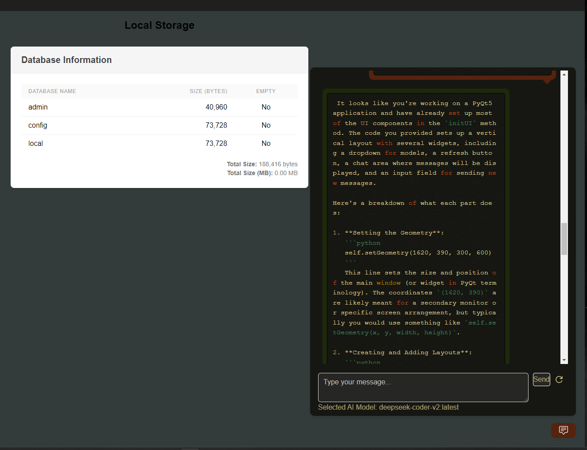
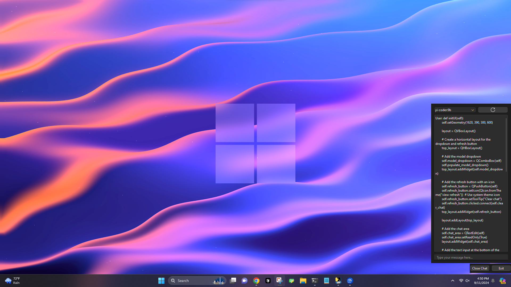

# Chat App with Ollama Models

## Overview

This repository hosts two main applications that allow users to interact with **Ollama models** for chatting, and provides integrations with **MongoDB** for storing data. The two applications are:

1.  **Electron/React Desktop App**
2.  **Python Desktop App**

## Features

### 1\. Electron/React Desktop App

-   **Multi-Model Chat:** Chat with up to 4 Ollama models simultaneously in a grid-view.
-   **MongoDB Client Integration:** Interact directly with a MongoDB database, allowing for storage or retrieval of chat data.
-   **Grid View Prompting:** Send a single prompt to multiple models at once and compare their responses side by side.
-   **User-Friendly Interface:** Built with Electron and React for a smooth, native desktop experience.

### 2\. Python Desktop App

-   **Always-On-Top Chat Window:** The chat window remains visible while using other applications.
-   **Collapsible Chat Interface:** Hide or show the chat window as needed to save screen space.
-   **Executable Included:** A pre-built `.exe` file for easy installation and use without needing to install Python dependencies.
-   Executable is located at **chat_python/dist/main.exe**

## Contributing

Contributions are welcome! Please open an issue or submit a pull request for any improvements or fixes.

## License

This project is licensed under the MIT License - see the LICENSE file for details.

